# Lendera — Documentación técnica y académica
### Prototipo de arquitectura de Microfrontends con Module Federation y Flux
**Curso:** Arquitectura Front-End · MSAS — Entrega 3  
**Fecha:** Abril 2026

---

## Tabla de contenidos

1. [Resumen ejecutivo](#1-resumen-ejecutivo)
2. [Análisis de crecimiento y justificación de microfrontends](#2-análisis-de-crecimiento-y-justificación-de-microfrontends)
3. [Dominios funcionales](#3-dominios-funcionales)
4. [Estrategia de integración](#4-estrategia-de-integración)
5. [Arquitectura del prototipo](#5-arquitectura-del-prototipo)
6. [Flujo de datos y comunicación](#6-flujo-de-datos-y-comunicación)
7. [Estructura del proyecto](#7-estructura-del-proyecto)
8. [Guía de instalación y uso](#8-guía-de-instalación-y-uso)
9. [Reflexión crítica](#9-reflexión-crítica)

---

## 1. Resumen ejecutivo

**Lendera** es una aplicación de micro-crédito que comenzó como un monolito React + Flux.  
Este prototipo la transforma en una **arquitectura de microfrontends** compuesta por seis aplicaciones independientes que se integran en tiempo de ejecución mediante **Webpack Module Federation** (implementado con `@originjs/vite-plugin-federation`).

| Aspecto | Valor |
|---|---|
| Integración | Client-side · Module Federation |
| Gestor de estado | Flux clásico (dispatcher → store → view) |
| Comunicación entre MFs | `window` CustomEvents (event bus) |
| Framework | React 18.3 + Vite |
| Número de aplicaciones | 6 (1 shell + 5 microfrontends) |
| Puertos | 3000–3005 |

---

## 2. Análisis de crecimiento y justificación de microfrontends

### 2.1 Escenario hipotético de crecimiento

Lendera nació como una startup con un equipo de 4–5 desarrolladores que compartían un único repositorio React. Con el crecimiento del negocio, la organización evolucionó de la siguiente manera:

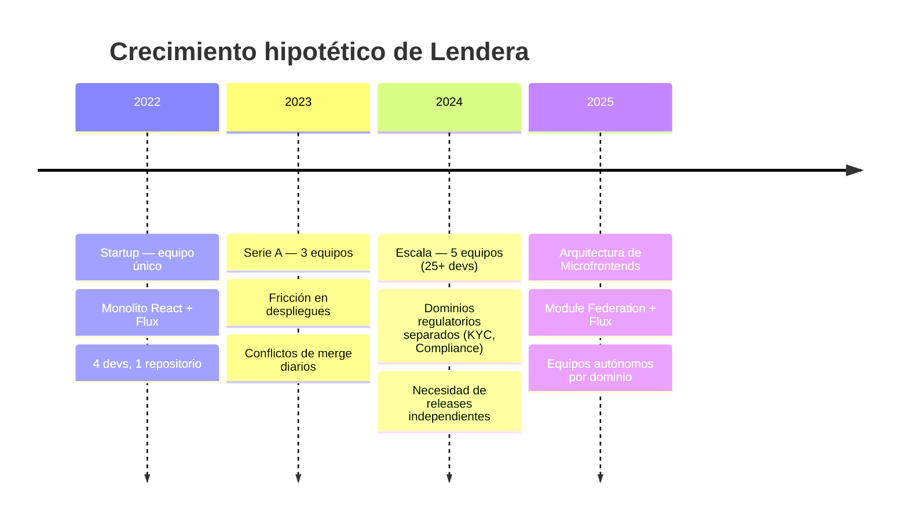

### 2.2 Problemas del monolito a escala

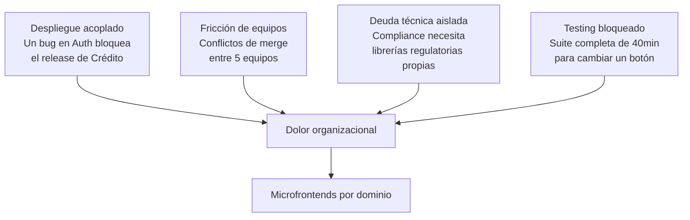

### 2.3 Justificación de la migración

| Problema monolito | Solución con microfrontends |
|---|---|
| Despliegue único acoplado | Cada MF se despliega de forma independiente |
| Equipos bloqueados entre sí | Autonomía total: repositorio, CI/CD y release propios |
| Una sola versión de librerías | Cada MF puede usar la versión que necesite |
| Sesiones de testing largas | Suite de tests pequeña y acotada por dominio |
| Cumplimiento regulatorio mezclado | Compliance y KYC aislados con sus propias dependencias |

---

## 3. Dominios funcionales

### 3.1 Mapa de dominios

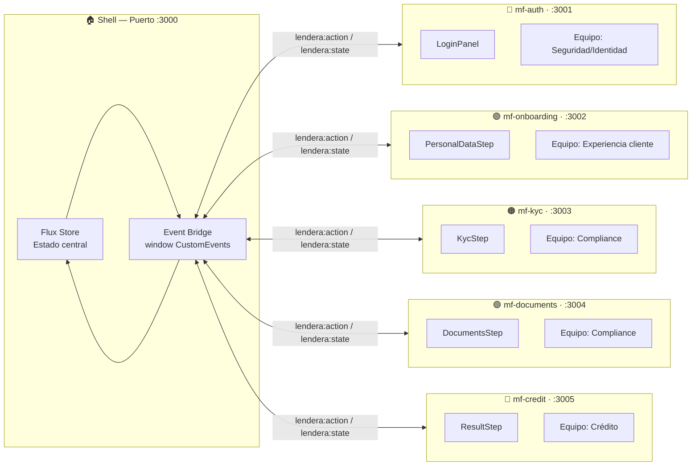

### 3.2 Tabla de dominios

| Microfrontend | Puerto | Dominio | Equipo responsable | Componente expuesto | Color |
|---|---|---|---|---|---|
| `mf-auth` | :3001 | Seguridad / Identidad | Equipo Auth | `LoginPanel` | Azul `#2563eb` |
| `mf-onboarding` | :3002 | Experiencia cliente | Equipo Onboarding | `PersonalDataStep` | Verde `#059669` |
| `mf-kyc` | :3003 | Compliance | Equipo Compliance | `KycStep` | Naranja `#d97706` |
| `mf-documents` | :3004 | Compliance | Equipo Compliance | `DocumentsStep` | Morado `#7c3aed` |
| `mf-credit` | :3005 | Crédito | Equipo Crédito | `ResultStep` | Rojo `#e11d48` |

### 3.3 Responsabilidades por dominio

**mf-auth — Seguridad / Identidad**  
Gestiona la autenticación del usuario. Emite `LOGIN_SUCCESS` con el nombre de usuario. No tiene conocimiento de los pasos del flujo; solo sabe si el usuario inició sesión.

**mf-onboarding — Experiencia cliente**  
Captura los datos personales del solicitante (nombre, identificación, ingreso, monto). Emite `SAVE_PERSONAL_DATA` con el formulario completo y provoca la transición automática al siguiente paso.

**mf-kyc — Compliance**  
Ejecuta la validación de identidad (KYC). Emite `START_KYC`; el shell simula el proceso asincrónico con una probabilidad de éxito del 80 %. El resultado llega de vuelta al MF por el event bus.

**mf-documents — Compliance**  
Gestiona la carga documental. Emite `UPLOAD_DOCUMENT`; el shell simula la carga con igual probabilidad de éxito/error y reintento.

**mf-credit — Crédito**  
Presenta el resultado de la evaluación crediticia. Emite `SUBMIT_FOR_REVIEW`; el shell decide aprobación (65 % de probabilidad) o rechazo con un timeout simulado.

---

## 4. Estrategia de integración

### 4.1 Comparativa de estrategias

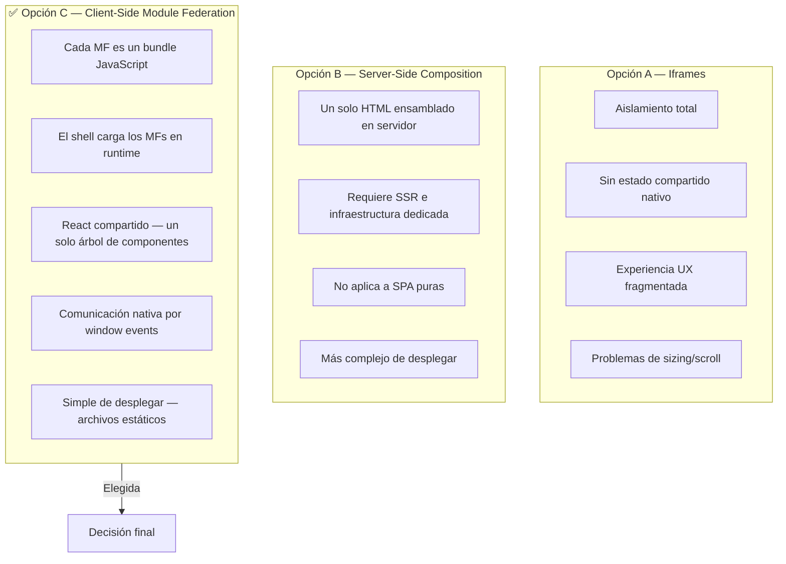

### 4.2 Justificación de Module Federation

Se eligió **integración client-side con Module Federation** por las siguientes razones:

1. **Compatibilidad con la base existente**: Lendera era una SPA React. Module Federation permite convertirla sin reescribir la lógica de negocio ni migrar a SSR.

2. **React compartido**: Al declarar `shared: ['react', 'react-dom']` en todos los `vite.config.js`, el runtime de Module Federation garantiza que todos los MFs usen la misma instancia de React, evitando el problema de "dos Reacts" que rompe los hooks.

3. **Despliegue como archivos estáticos**: Cada MF se construye con `vite build` y se sirve con `vite preview` (o cualquier CDN). No hay servidor de aplicaciones.

4. **Carga dinámica en runtime**: Con `React.lazy(() => import('mfAuth/LoginPanel'))` el shell descarga el bundle del MF solo cuando lo necesita, reduciendo el tiempo de carga inicial.

5. **`ErrorBoundary` por MF**: Si un microfrontend falla al cargar (red caída, error de build), el `MFWrapper` captura el error y muestra un mensaje localizado sin derribar toda la aplicación.

### 4.3 Configuración de Module Federation

**Shell (host):**
```js
// shell/vite.config.js
federation({
  name: 'shell',
  remotes: {
    mfAuth:       'http://localhost:3001/assets/remoteEntry.js',
    mfOnboarding: 'http://localhost:3002/assets/remoteEntry.js',
    mfKyc:        'http://localhost:3003/assets/remoteEntry.js',
    mfDocuments:  'http://localhost:3004/assets/remoteEntry.js',
    mfCredit:     'http://localhost:3005/assets/remoteEntry.js',
  },
  shared: ['react', 'react-dom'],
})
```

**Cada remoto (ejemplo mf-auth):**
```js
// microfrontends/mf-auth/vite.config.js
federation({
  name: 'mfAuth',
  filename: 'remoteEntry.js',
  exposes: { './LoginPanel': './src/LoginPanel.jsx' },
  shared: ['react', 'react-dom'],
})
```

---

## 5. Arquitectura del prototipo

### 5.1 Diagrama de arquitectura general

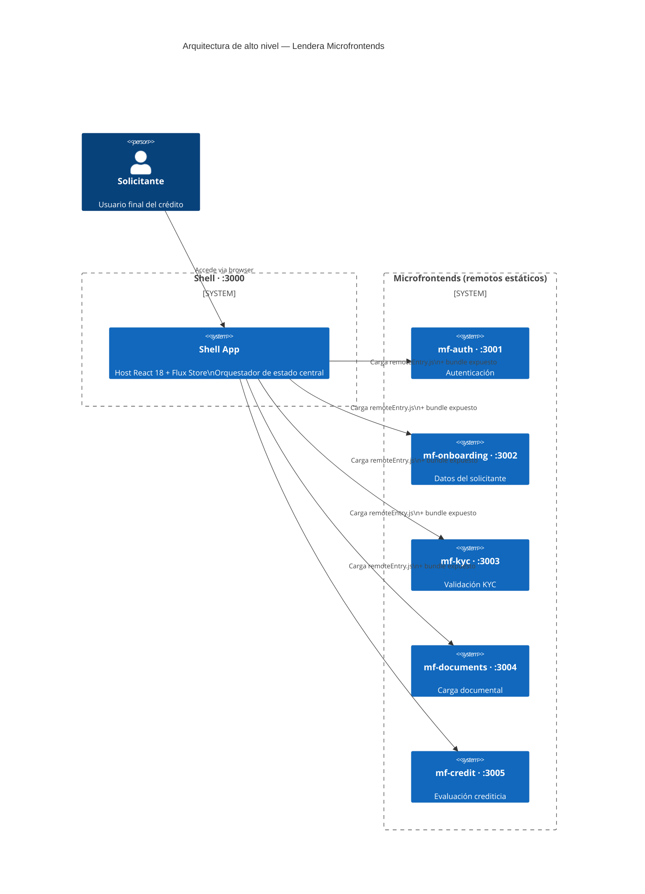

### 5.2 Arquitectura Flux en el shell

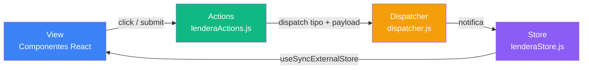

**Ciclo completo:**
1. El usuario interactúa con un componente (View)
2. El componente llama a un método de `lenderaActions`
3. `lenderaActions` llama a `dispatcher.dispatch({ type, payload })`
4. El `lenderaStore` registrado en el dispatcher actualiza su estado interno
5. `useSyncExternalStore` detecta el cambio y re-renderiza los componentes suscritos

### 5.3 Árbol de componentes del shell

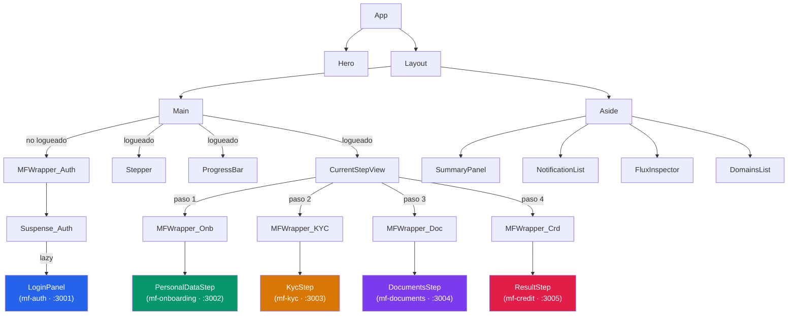

---

## 6. Flujo de datos y comunicación

### 6.1 Event Bus — protocolo de comunicación

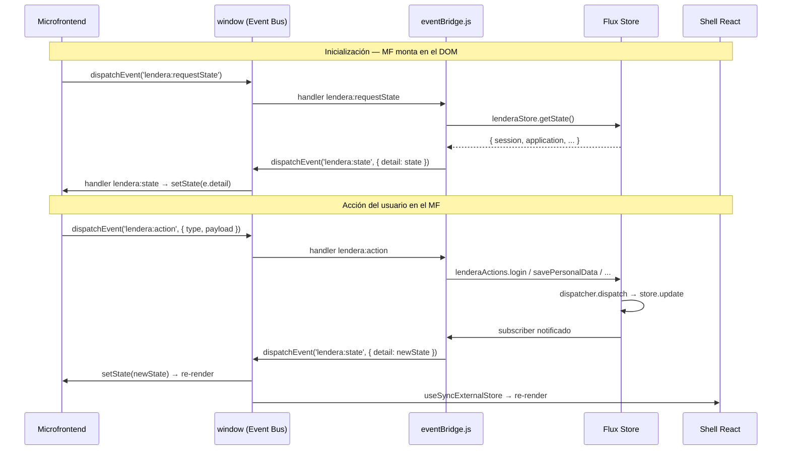

### 6.2 Flujo de la aplicación (máquina de estados)

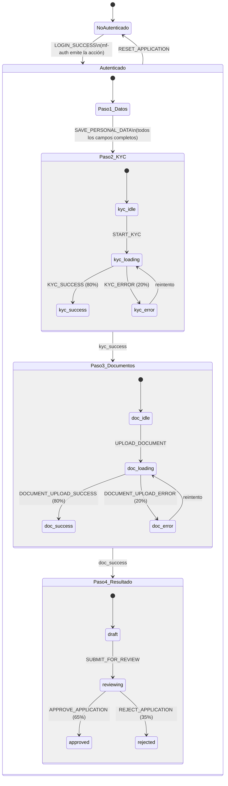

### 6.3 Acciones del sistema

| Acción (CustomEvent type) | Emitida por | Manejada en shell como | Efecto |
|---|---|---|---|
| `LOGIN_SUCCESS` | `mf-auth` | `lenderaActions.login()` | Autentica usuario, avanza a paso 1 |
| `SAVE_PERSONAL_DATA` | `mf-onboarding` | `lenderaActions.savePersonalData()` | Guarda formulario, avanza a paso 2 |
| `START_KYC` | `mf-kyc` | `lenderaActions.startKyc()` | Simula KYC asincrónico (1.4 s) |
| `UPLOAD_DOCUMENT` | `mf-documents` | `lenderaActions.uploadDocument()` | Simula carga documental (1.4 s) |
| `SUBMIT_FOR_REVIEW` | `mf-credit` | `lenderaActions.submitForReview()` | Simula evaluación crediticia (1.6 s) |
| `GO_TO_STEP` | Shell UI | `lenderaActions.goToStep()` | Navegación directa a un paso |
| `RESET_APPLICATION` | Shell UI | `lenderaActions.resetApplication()` | Reinicia toda la sesión |

---

## 7. Estructura del proyecto

### 7.1 Árbol de carpetas

```
prototype-lendera-flux-react/
│
├── package.json                  ← Orquestador raíz (concurrently)
├── DOCUMENTACION.md              ← Este documento
│
├── shell/                        ← Host — Puerto :3000
│   ├── vite.config.js            ← Configuración Module Federation (host)
│   ├── index.html
│   └── src/
│       ├── main.jsx              ← initEventBridge() + ReactDOM.render
│       ├── App.jsx               ← Layout principal + CurrentStepView
│       ├── eventBridge.js        ← Puente window ↔ Flux
│       ├── constants.js          ← MF_DOMAINS, steps
│       ├── actions/
│       │   └── lenderaActions.js ← Action creators Flux
│       ├── flux/
│       │   ├── dispatcher.js     ← Dispatcher centralizado
│       │   └── lenderaStore.js   ← Store con useSyncExternalStore
│       ├── hooks/
│       │   └── useLenderaStore.js
│       └── components/
│           ├── MFWrapper.jsx     ← ErrorBoundary + Suspense
│           ├── Stepper.jsx
│           ├── SummaryPanel.jsx
│           ├── NotificationList.jsx
│           └── FluxInspector.jsx
│
└── microfrontends/
    ├── mf-auth/                  ← Remoto — Puerto :3001
    │   ├── vite.config.js        ← Expone ./LoginPanel
    │   └── src/
    │       └── LoginPanel.jsx
    │
    ├── mf-onboarding/            ← Remoto — Puerto :3002
    │   ├── vite.config.js        ← Expone ./PersonalDataStep
    │   └── src/
    │       └── PersonalDataStep.jsx
    │
    ├── mf-kyc/                   ← Remoto — Puerto :3003
    │   ├── vite.config.js        ← Expone ./KycStep
    │   └── src/
    │       └── KycStep.jsx
    │       └── StatusBadge.jsx
    │
    ├── mf-documents/             ← Remoto — Puerto :3004
    │   ├── vite.config.js        ← Expone ./DocumentsStep
    │   └── src/
    │       └── DocumentsStep.jsx
    │       └── StatusBadge.jsx
    │
    └── mf-credit/                ← Remoto — Puerto :3005
        ├── vite.config.js        ← Expone ./ResultStep
        └── src/
            └── ResultStep.jsx
            └── StatusBadge.jsx
```

### 7.2 Flujo de build y ejecución

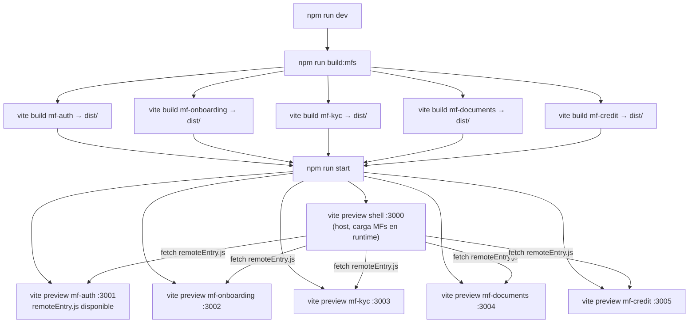

---

## 8. Guía de instalación y uso

### 8.1 Requisitos previos

- Node.js 18 o superior
- npm 9 o superior

### 8.2 Instalación

```bash
# 1. Clonar o descomprimir el repositorio
cd prototype-lendera-flux-react

# 2. Instalar dependencias del orquestador raíz
npm install

# 3. Instalar dependencias de cada microfrontend
npm run install:all
```

### 8.3 Levantar el sistema completo

```bash
npm run dev
```

Este comando ejecuta en secuencia:
1. **`build:mfs`** — construye los 5 microfrontends generando sus `dist/`
2. **`start`** — levanta 6 servidores simultáneos con `concurrently`

> La primera ejecución puede tardar ~60 segundos mientras se construyen todos los bundles.

### 8.4 Acceso

Abrir el navegador en: **`http://localhost:3000`**

### 8.5 Flujo de demostración

1. **Login** — ingresar cualquier nombre de usuario y hacer clic en "Ingresar"
2. **Paso 1 — Datos** — completar los 4 campos del formulario y hacer clic en "Guardar y continuar"
3. **Paso 2 — KYC** — hacer clic en "Ejecutar KYC" (80 % de probabilidad de éxito; si falla, reintentar)
4. **Paso 3 — Documentos** — hacer clic en "Subir documento" (igual probabilidad)
5. **Paso 4 — Resultado** — hacer clic en "Enviar a revisión" (65 % aprobado / 35 % rechazado)

Los botones **Retroceder** y **Reiniciar demo** en el header permiten navegar libremente.

### 8.6 Puertos y servicios

| Servicio | URL | Descripción |
|---|---|---|
| Shell | http://localhost:3000 | Aplicación principal (host) |
| mf-auth | http://localhost:3001 | Servidor estático del remoto Auth |
| mf-onboarding | http://localhost:3002 | Servidor estático del remoto Onboarding |
| mf-kyc | http://localhost:3003 | Servidor estático del remoto KYC |
| mf-documents | http://localhost:3004 | Servidor estático del remoto Documents |
| mf-credit | http://localhost:3005 | Servidor estático del remoto Credit |

### 8.7 Verificación de carga de MFs

Para confirmar que los bundles remotos están siendo servidos correctamente:

```bash
# Verificar remoteEntry.js de cada MF
curl -I http://localhost:3001/assets/remoteEntry.js
curl -I http://localhost:3002/assets/remoteEntry.js
curl -I http://localhost:3003/assets/remoteEntry.js
curl -I http://localhost:3004/assets/remoteEntry.js
curl -I http://localhost:3005/assets/remoteEntry.js
```

Todos deben responder `HTTP/1.1 200 OK` con el header `Access-Control-Allow-Origin: *`.

---

## 9. Reflexión crítica

### 9.1 Decisiones arquitectónicas y su razonamiento

#### Flux sobre Redux o Zustand

Se mantuvo el patrón Flux clásico (heredado del monolito) en lugar de migrarlo a una librería moderna. La razón es pedagógica y práctica: Flux expone explícitamente el ciclo unidireccional (View → Action → Dispatcher → Store → View), lo que facilita razonar sobre el flujo de datos en un sistema distribuido. En producción, Zustand o Redux Toolkit serían más ergonómicos.

#### Event Bus sobre props drilling o Context API

Los microfrontends son **aplicaciones externas**: no tienen acceso al árbol de componentes React del shell. Las únicas primitivas de comunicación cross-origen disponibles en el browser son `window` events, `postMessage` y `BroadcastChannel`. Se eligió `CustomEvent` sobre `window` por su simplicidad y por la naturaleza Single-Page (mismo origen, mismo `window`).

#### `ErrorBoundary` por microfrontend

Cada MF está envuelto en un `MFWrapper` que combina `ErrorBoundary` (clase React) con `Suspense`. Esto significa que si el servidor del MF está caído o el bundle tiene un error de JavaScript, solo ese componente falla; el resto de la aplicación sigue funcionando. Es el equivalente frontend del patrón **Circuit Breaker**.

#### `key` props en `CurrentStepView`

Un error inicial en la implementación definía los componentes de paso como un objeto estático en el ámbito del módulo:
```jsx
// ❌ Error: ErrorBoundary no se resetea entre pasos
const stepComponents = {
  1: <MFWrapper name="mf-onboarding"><PersonalDataStep /></MFWrapper>,
  2: <MFWrapper name="mf-kyc"><KycStep /></MFWrapper>,
};
```
El problema: React veía el mismo tipo de componente (`MFWrapper`) y reutilizaba la instancia de `ErrorBoundary`, propagando el estado de error de un paso a otro. La solución fue crear `CurrentStepView` con `key` explícitos por paso (`key="onb"`, `key="kyc"`, etc.), forzando a React a desmontar y montar una instancia nueva de `ErrorBoundary` en cada transición.

### 9.2 Limitaciones del prototipo

| Limitación | Impacto | Solución en producción |
|---|---|---|
| `vite preview` como servidor de producción | No es un servidor HTTP de producción | nginx, AWS CloudFront, o Vercel |
| Estados simulados con `Math.random()` | No refleja lógica de negocio real | APIs REST / GraphQL por dominio |
| Sin autenticación real | Cualquier nombre ingresa | OAuth 2.0 + JWT |
| Sin persistencia | El estado se pierde al recargar | localStorage, IndexedDB, o sesión en backend |
| CORS solo en desarrollo | `cors: true` en `vite preview` no es adecuado para producción | Headers CORS configurados en el servidor de archivos estáticos |

### 9.3 Aprendizajes clave

1. **Module Federation resuelve el problema de dependencias compartidas**, pero requiere configuración explícita. Sin `shared: ['react', 'react-dom']`, cada MF carga su propia copia de React y los hooks fallan porque React detecta múltiples instancias.

2. **El event bus es poderoso pero requiere disciplina de naming**. En un sistema grande, los nombres de eventos (`lendera:action`, `lendera:state`) deben estar versionados o namespaceados por dominio para evitar colisiones.

3. **La autonomía de equipos tiene un coste de coordinación**. Cada MF tiene su propio `package.json` y ciclo de build, lo que es exactamente el objetivo, pero requiere un orquestador (el `package.json` raíz con `concurrently`) para el desarrollo local.

4. **Los ErrorBoundary deben estar en el nivel correcto**. Envolverlos demasiado arriba oculta errores de todo el árbol; demasiado abajo no protege suficiente superficie. Un `MFWrapper` por remote component es el equilibrio correcto.

5. **`React.lazy` + Suspense + Module Federation = carga bajo demanda real**. El bundle de `mf-credit` no se descarga hasta que el usuario llega al paso 4, reduciendo la carga inicial del shell.

### 9.4 Visión a futuro

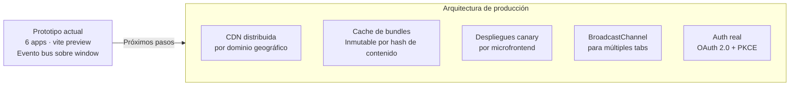

---

*Documentación generada para el prototipo Lendera — Arquitectura Front-End MSAS · Entrega 3*
